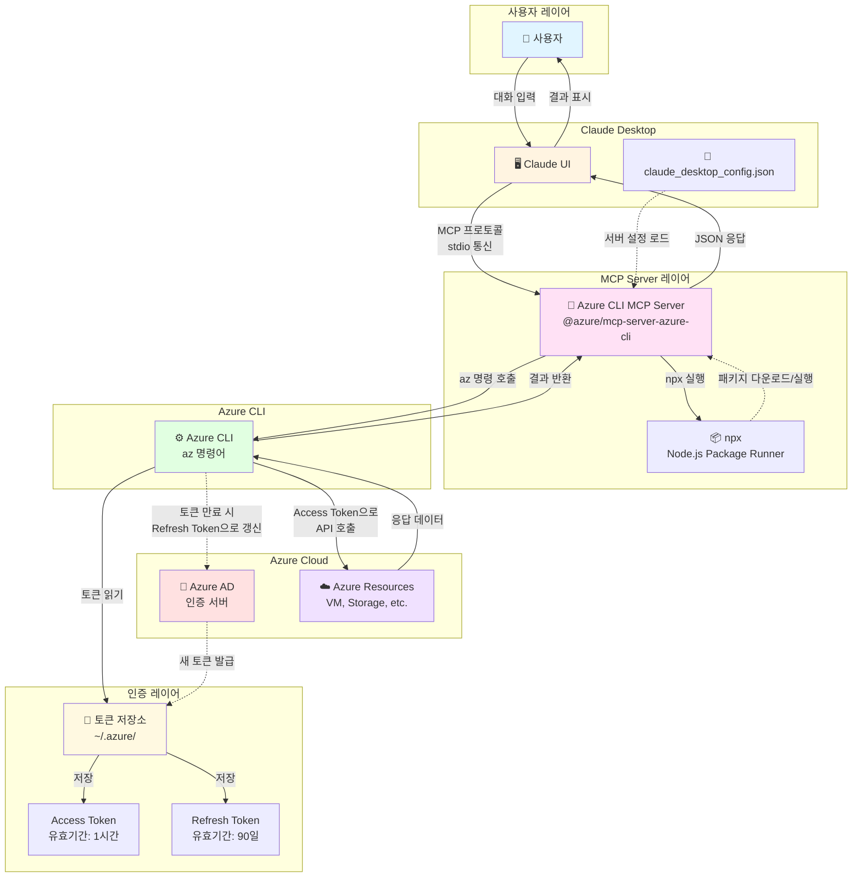
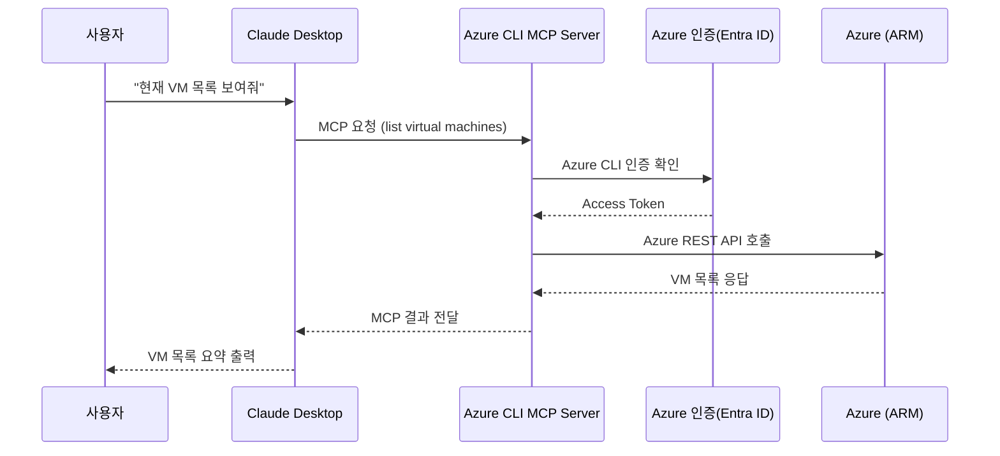
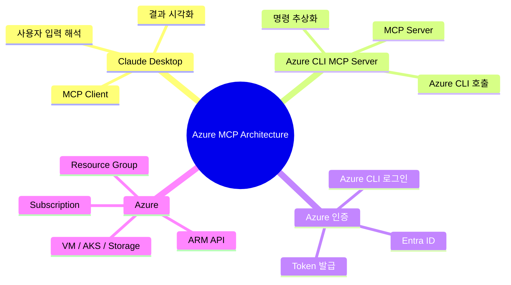

# 1. 개요

Azure 를 접속하여 Azure VM 목록 등 자원을 관리하는 MCP 서버를 설치하고 접근한다.

* Azure의 Compute 리소스에 접근할 수 있는 MCP 서버가 필요


## 1) 구조

### 전체 구조




### sequenceDiagram




### mindmap




- Claude는 **Azure를 직접 호출하지 않음**

- 모든 Azure 접근은 **Azure CLI MCP Server**를 통해 수행

- 인증은 **Azure CLI 로그인 상태를 그대로 재사용**

- MCP 덕분에:

  - Claude ↔ Azure 사이 결합도 
  - 보안 경계 명확
  - 다른 LLM(Client)로 확장 가능

  


# 2. Azure CLI MCP 설치

## 1) Azure CLI 기반 MCP 서버 설치

Azure VM을 조회하는 가장 좋은 방법은 Azure CLI를 사용하는 MCP 서버입니다.

**먼저 Azure CLI 설치:**

```bash
# Homebrew로 설치
brew update && brew install azure-cli

# 설치 확인
az --version
```

**Azure 로그인:**

```bash
az login
```


## 2) MCP 서버 설정 방법

### Azure MCP 서버

Microsoft에서 공식적으로 Azure CLI를 래핑한 MCP 서버가 있고, VM 목록 조회 등을 지원함


### azure-cli-mcp 설치

이 MCP 서버는 Azure CLI를 통해 VM 생성, 수정, 삭제 등의 작업을 Claude에서 직접 수행할 수 있게 해준다.

**설치 방법:**

```bash
# 저장소 클론
git clone https://github.com/St8ntonWil3y/azure-cli-mcp.git
cd azure-cli-mcp

# 의존성 설치
npm install

# 빌드
npm run build

# 전역 링크 (선택사항)
npm link
```


### 확인

node 로 수행되고 있는 MCP 서버들 확인

```sh
# MCP 서버 관련 Node 프로세스 찾기
$ ps aux | grep mcp

song             29473   0.0  0.0 410724096   1344 s004  S+   11:10PM   0:00.00 grep mcp
song             27484   0.0  0.1 412467792  53856   ??  S     9:26PM   0:00.13 /usr/local/bin/node /Users/song/mcp-server/azure-cli-mcp/dist/index.js
song             27483   0.0  0.0 410592976   1136   ??  S     9:26PM   0:00.00 /Applications/Claude.app/Contents/Helpers/disclaimer /usr/local/bin/node /Users/song/mcp-server/azure-cli-mcp/dist/index.js


# 또는 더 구체적으로
$ ps aux | grep "mcp-server-azure-cli"
song             29470   0.0  0.0 410724096   1360 s004  S+   11:09PM   0:00.00 grep mcp-server-azure-cli

```


### 수동으로 MCP 서버 실행

```sh

# 직접 실행 (Claude Desktop 없이)
$ npx -y @azure/mcp-server-azure-cli

# 특정 버전 실행
$ npx @azure/mcp-server-azure-cli@latest

# verbose 모드
DEBUG=* npx -y @azure/mcp-server-azure-cli

```


**Azure CLI 설정:**

```bash
# Azure CLI 설치 (아직 안 했다면)
brew install azure-cli

# Azure 로그인
az login

# 현재 구독 확인
az account show
```

**Claude Desktop 설정:**

`~/Library/Application Support/Claude/claude_desktop_config.json` 파일을 생성/편집:

```json
{
  "mcpServers": {
    "azure-cli": {
      "command": "node",
      "args": ["/path/to/azure-cli-mcp/build/index.js"]
    }
  }
}
```

위의 `/path/to/azure-cli-mcp`를 실제 클론한 경로로 변경


## 3) 테스트


### 1) Claude Desktop 재시작 후 테스트:

Claude desktop 에서 "Azure VM 목록 조회해줘"라고 요청


```

Azure VM 목록 조회해줘

VM 목록들의 CPU 사용율을 알려줘.


```


# 3. Cleanup


## 1) Claude Desktop 에서 제거

### (1) Claude Desktop 설정 파일 수정

파일내에 아래 azure-cli Server 삭제

```sh

$ vi ~/Library/Application\ Support/Claude/claude_desktop_config.json
{
  "mcpServers": {
    "azure-cli": {
      "command": "npx",
      "args": ["-y", "@azure/mcp-server-azure-cli"]
    },
    "other-server": {
      ...
    }
  }
}


```


### (2) Claude Desktop 재시작

```sh

killall Claude
or 

직접 종료
```


## 2) MCP 서버 프로세스 제거


### (1) 실행 중인 MCP 서버 프로세스 강제 종료

```sh

# Azure MCP 서버 프로세스 찾기 및 종료
$ pkill -f "mcp-server-azure-cli"

# 또는 더 강력하게
$ ps aux | grep "mcp-server-azure-cli" | grep -v grep | awk '{print $2}' | xargs kill -9


```


### (2) NPM 캐시 및 패키지 삭제

```sh

# npx 캐시 삭제
rm -rf ~/.npm/_npx

# 전역 node_modules에서 Azure MCP 서버 제거 (설치된 경우)
npm uninstall -g @azure/mcp-server-azure-cli

# npm 캐시 정리
npm cache clean --force

```

