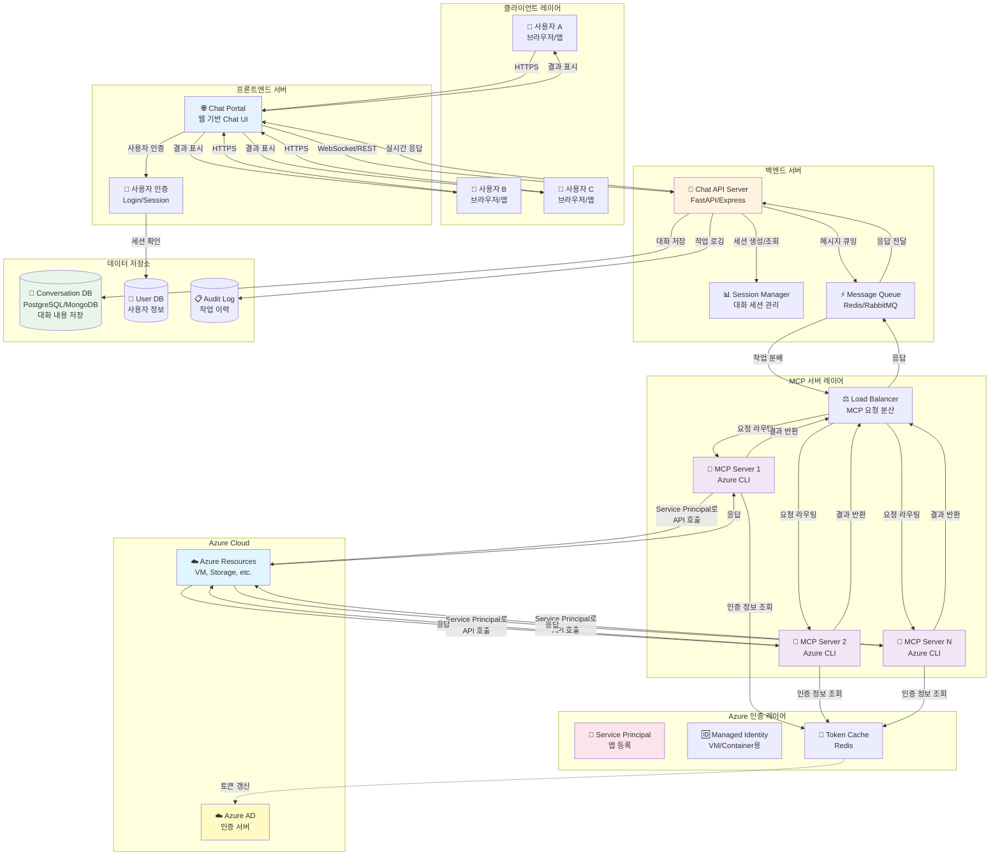

# 멀티유저 Azure MCP 아키텍처 설계


## 1. 아키텍처 개요

현재 로컬 환경 (Mac)에서 단일 사용자로 동작하는 구조를:

- **Claude Desktop → MCP Server → Azure**

다중 사용자를 지원하는 웹 기반 SaaS 구조로 전환:

- **Chat Portal → API Server → MCP Server Pool → Azure**


### 다이어그램



### 핵심포인트

* Chat Portal: Claude Desktop을 대체하는 웹 기반 UI

* API Server: 클라이언트와 MCP 서버 간 중계

* MCP Server Pool: 여러 인스턴스로 확장 가능

* Service Principal: 개인 계정 대신 앱 전용 계정 사용

* Token Cache (Redis): 중앙 집중식 토큰 관리

* Database: 대화 내용 영구 저장

* Audit Log: 모든 작업 기록


------

## 2. 주요 컴포넌트

### 2.1 클라이언트 레이어

#### Chat Portal (웹 기반 UI)

- **역할**: Claude Desktop을 대체하는 웹 기반 채팅 인터페이스

- 기술 스택

  :

  - React / Vue.js / Next.js
  - WebSocket for 실시간 통신
  - TailwindCSS for UI

- 기능

  :

  - 대화형 채팅 인터페이스
  - 대화 히스토리 조회
  - 사용자 설정 관리

#### 사용자 인증

- **기술**: OAuth 2.0, JWT

- 기능

  :

  - 로그인/로그아웃
  - 세션 관리
  - 권한 관리 (RBAC)

------

### 2.2 백엔드 서버

#### Chat API Server

- **역할**: 클라이언트와 MCP 서버 간 중계

- 기술 스택

  :

  - **Node.js**: Express.js, Fastify
  - **Python**: FastAPI, Django
  - **Go**: Gin, Echo

- 기능

  :

  - REST API / GraphQL 엔드포인트
  - WebSocket 연결 관리
  - 요청/응답 처리
  - 에러 핸들링

#### Session Manager

- **역할**: 사용자별 대화 세션 관리

- 기능

  :

  - 세션 생성/삭제/조회
  - 컨텍스트 유지
  - 타임아웃 관리

#### Message Queue

- **역할**: 비동기 메시지 처리 및 부하 분산

- 기술

  :

  - Redis (Pub/Sub)
  - RabbitMQ
  - Apache Kafka (대규모)

- 장점

  :

  - 요청 버퍼링
  - 스케일 아웃 용이
  - 장애 복구

------

### 2.3 MCP 서버 레이어

#### MCP Server Pool

- **구성**: 여러 MCP 서버 인스턴스

- 배포 방식

  :

  - **Docker Container**: 독립적인 컨테이너로 실행
  - **Kubernetes Pod**: 자동 스케일링
  - **VM**: 전통적인 방식

- 특징

  :

  - 수평 확장 가능
  - 장애 격리
  - 독립적인 프로세스 공간

#### Load Balancer

- 기술

  :

  - Nginx
  - HAProxy
  - AWS ALB / Azure Load Balancer

- 기능

  :

  - Round-robin / Least connection
  - Health check
  - Auto-scaling trigger

------

### 2.4 Azure 인증 레이어 (핵심 변경점!)

현재 로컬 방식과의 가장 큰 차이점입니다.

#### 현재 (개인 Mac)

```
개인 계정으로 로그인 → ~/.azure/에 토큰 저장
```

#### 멀티유저 환경

```
Service Principal 또는 Managed Identity 사용
```

#### Service Principal (권장)

- **개념**: 애플리케이션 전용 계정
- **설정**:

```bash
# Service Principal 생성
az ad sp create-for-rbac --name "mcp-server-app" \
  --role Contributor \
  --scopes /subscriptions/{subscription-id}

# 결과
{
  "appId": "xxxxx",
  "password": "xxxxx",
  "tenant": "xxxxx"
}
```

- **환경변수로 설정**:

```bash
export AZURE_CLIENT_ID="xxxxx"
export AZURE_CLIENT_SECRET="xxxxx"
export AZURE_TENANT_ID="xxxxx"
```

#### Managed Identity (컨테이너/VM용)

- **장점**: 비밀번호 관리 불필요
- **사용**: Azure VM, AKS, Container Instances에서 실행 시

#### Token Cache (Redis)

- **역할**: 토큰 중앙 집중 관리
- **구조**:

```
Key: azure:token:{service_principal_id}
Value: {
  "access_token": "...",
  "expires_at": "2026-01-17T13:30:00Z"
}
TTL: 3600 (1시간)
```

- 장점

  :

  - 토큰 재사용
  - 인증 API 호출 최소화
  - 중앙 집중 관리

------

### 2.5 데이터 저장소

#### Conversation Database

- **역할**: 대화 내용 영구 저장

- 기술

  :

  - **PostgreSQL**: 구조화된 데이터, 트랜잭션
  - **MongoDB**: 유연한 스키마, JSON 저장

- **스키마 예시**:

```sql
CREATE TABLE conversations (
  id UUID PRIMARY KEY,
  user_id UUID NOT NULL,
  created_at TIMESTAMP,
  updated_at TIMESTAMP
);

CREATE TABLE messages (
  id UUID PRIMARY KEY,
  conversation_id UUID REFERENCES conversations(id),
  role VARCHAR(20), -- user, assistant, system
  content TEXT,
  timestamp TIMESTAMP,
  metadata JSONB
);
```

#### User Database

- **역할**: 사용자 정보 관리

- 저장 내용

  :

  - 사용자 프로필
  - 권한 정보
  - 사용량 통계

#### Audit Log

- **역할**: 모든 Azure 작업 기록

- 내용

  :

  - 누가 (user_id)
  - 언제 (timestamp)
  - 무엇을 (operation)
  - 어떻게 (parameters, result)

- 중요성

  :

  - 보안 감사
  - 비용 추적
  - 문제 디버깅

------

## 3. 핵심 차이점 요약

| 항목          | 현재 (로컬 Mac)      | 멀티유저 환경       |
| ------------- | -------------------- | ------------------- |
| **UI**        | Claude Desktop       | 웹 기반 Chat Portal |
| **인증**      | 개인 계정 (az login) | Service Principal   |
| **토큰 저장** | ~/.azure/            | Redis (중앙 집중)   |
| **MCP 서버**  | 단일 프로세스        | 서버 풀 (N개)       |
| **대화 저장** | 없음                 | Database 영구 저장  |
| **사용자**    | 1명                  | N명 (동시 접속)     |
| **확장성**    | 불가                 | 수평 확장 가능      |

------

## 4. 구현 시 고려사항

### 4.1 보안

- **Service Principal 권한 최소화**: 필요한 리소스/작업만 허용
- **사용자별 격리**: 사용자 A가 사용자 B의 리소스 접근 불가
- **감사 로그**: 모든 Azure 작업 기록
- **비밀 관리**: Azure Key Vault 사용

### 4.2 성능

- **Connection Pool**: Azure API 연결 재사용
- **Token Caching**: Redis로 토큰 캐싱
- **Message Queue**: 비동기 처리로 응답 속도 개선
- **CDN**: 정적 리소스 캐싱

### 4.3 비용 최적화

- **MCP 서버 Auto-scaling**: 사용량에 따라 자동 확장/축소
- **Token 재사용**: 불필요한 인증 API 호출 방지
- **Request Batching**: 가능한 경우 요청 묶음 처리

### 4.4 모니터링

- **Application Insights**: 성능 모니터링
- **Prometheus + Grafana**: 메트릭 수집/시각화
- **ELK Stack**: 로그 집계 및 분석
- **Health Check**: 각 컴포넌트 상태 모니터링

------

## 5. 배포 전략

### 5.1 개발 환경

```
Docker Compose로 로컬에서 전체 스택 실행
```

### 5.2 프로덕션 환경

- **Kubernetes (AKS)**: 컨테이너 오케스트레이션
- **Helm Charts**: 배포 자동화
- **CI/CD**: GitHub Actions, Azure DevOps

### 5.3 인프라 코드

- **Terraform**: Azure 리소스 프로비저닝
- **Ansible**: 서버 구성 관리

------

## 6. 단계별 마이그레이션 전략

### Phase 1: POC

- 단일 Chat Portal + 단일 MCP 서버
- In-memory 세션 관리
- 소수 사용자 테스트

### Phase 2: MVP

- Database 추가 (대화 저장)
- Redis 추가 (토큰 캐싱)
- 사용자 인증 구현

### Phase 3: Scale

- MCP 서버 풀 구성
- Load Balancer 추가
- Message Queue 도입

### Phase 4: Enterprise

- Multi-tenancy 지원
- 고급 모니터링
- 재해 복구 (DR)

------

## 7. 예상 기술 스택

### 프론트엔드

- React + TypeScript
- WebSocket (Socket.io)
- TailwindCSS

### 백엔드

- FastAPI (Python) 또는 Express.js (Node.js)
- Redis (Cache + Queue)
- PostgreSQL

### 인프라

- Azure Kubernetes Service (AKS)
- Azure Container Registry (ACR)
- Azure Application Gateway

### 모니터링

- Azure Monitor
- Application Insights
- Grafana

------

## 8. 참고 아키텍처

비슷한 구조를 가진 서비스:

- **ChatGPT**: 웹 UI + API 서버 + Model 서버
- **Slack Bot**: 웹훅 + Bot 서버 + 외부 API
- **Jupyter Hub**: 웹 UI + 다중 커널 관리