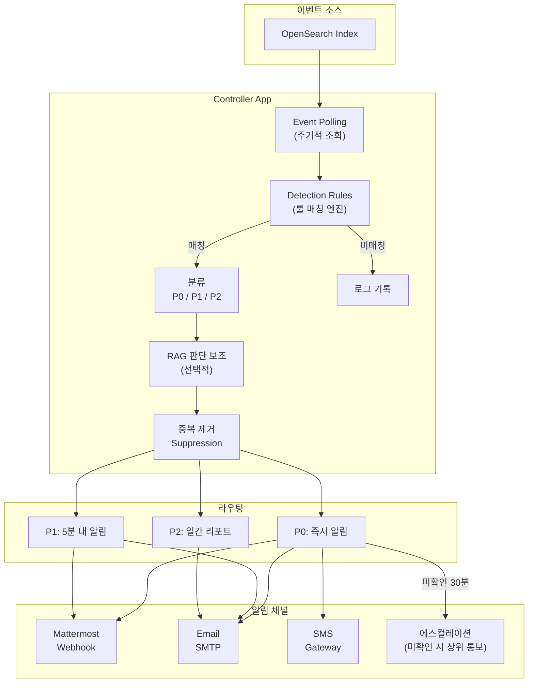

```mermaid
graph TD
    subgraph Source["이벤트 소스"]
        OS["OpenSearch Index"]
    end

    subgraph Controller["Controller App"]
        Poll["Event Polling<br/>(주기적 조회)"]
        Rules["Detection Rules<br/>(룰 매칭 엔진)"]
        Classify["분류<br/>P0 / P1 / P2"]
        RAG["RAG 판단 보조<br/>(선택적)"]
        Dedup["중복 제거<br/>Suppression"]
        Log["로그 기록"]
    end
    
    subgraph Routing["라우팅"]
        P0["P0: 즉시 알림"]
        P1["P1: 5분 내 알림"]
        P2["P2: 일간 리포트"]
    end
    
    subgraph Channels["알림 채널"]
        MM["Mattermost<br/>Webhook"]
        Email["Email<br/>SMTP"]
        SMS["SMS<br/>Gateway"]
        Escalation["에스컬레이션<br/>(미확인 시 상위 통보)"]
    end
    
    OS --> Poll
    Poll --> Rules

    Rules -->|매칭| Classify
    Rules -->|미매칭| Log

    Classify --> RAG
    RAG --> Dedup

    Dedup --> P0
    Dedup --> P1
    Dedup --> P2

    P0 --> MM
    P0 --> Email
    P0 --> SMS

    P1 --> MM
    P1 --> Email

    P2 --> Email

    P0 -->|미확인 30분| Escalation
```

