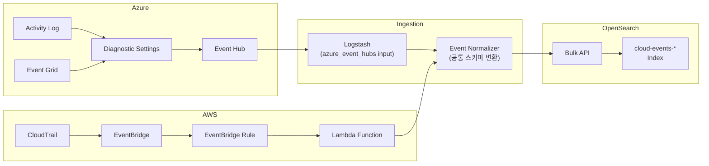

```mermaid

graph LR
    subgraph Azure["Azure"]
        AL["Activity Log"]
        EG["Event Grid"]
        DS["Diagnostic Settings"]
        EH["Event Hub"]
    end

    subgraph AWS["AWS"]
        CT["CloudTrail"]
        EB["EventBridge"]
        Rule["EventBridge Rule"]
        LF["Lambda Function"]
    end
    
    subgraph Ingestion["Ingestion"]
        LS["Logstash<br/>(azure_event_hubs input)"]
        Normalize["Event Normalizer<br/>(공통 스키마 변환)"]
    end
    
    subgraph OpenSearch["OpenSearch"]
        BulkAPI["Bulk API"]
        Index["cloud-events-*<br/>Index"]
    end
    
    AL --> DS --> EH --> LS
    EG --> DS
    LS --> Normalize --> BulkAPI --> Index
    
    CT --> EB --> Rule --> LF
    LF --> Normalize
```
