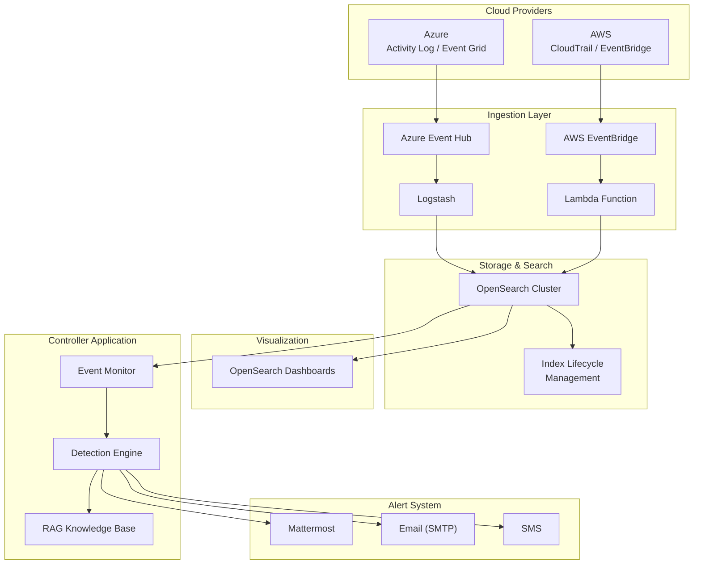

```mermaid
graph TB
    subgraph Cloud["Cloud Providers"]
        Azure["Azure<br/>Activity Log / Event Grid"]
        AWS["AWS<br/>CloudTrail / EventBridge"]
    end

    subgraph Ingestion["Ingestion Layer"]
        EventHub["Azure Event Hub"]
        EventBridge["AWS EventBridge"]
        Logstash["Logstash"]
        Lambda["Lambda Function"]
    end
    
    subgraph Storage["Storage & Search"]
        OS["OpenSearch Cluster"]
        ILM["Index Lifecycle<br/>Management"]
    end
    
    subgraph Visualization["Visualization"]
        OSD["OpenSearch Dashboards"]
    end
    
    subgraph Controller["Controller Application"]
        Monitor["Event Monitor"]
        Detector["Detection Engine"]
        RAG["RAG Knowledge Base"]
    end
    
    subgraph Alerting["Alert System"]
        MM["Mattermost"]
        Email["Email (SMTP)"]
        SMS["SMS"]
    end
    
    Azure --> EventHub --> Logstash --> OS
    AWS --> EventBridge --> Lambda --> OS
    OS --> ILM
    OS --> OSD
    OS --> Monitor --> Detector
    Detector --> RAG
    Detector --> MM
    Detector --> Email
    Detector --> SMS
```